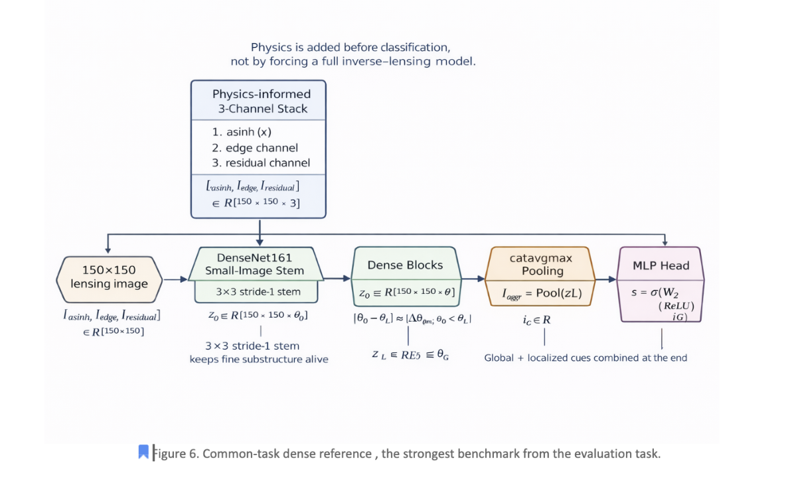
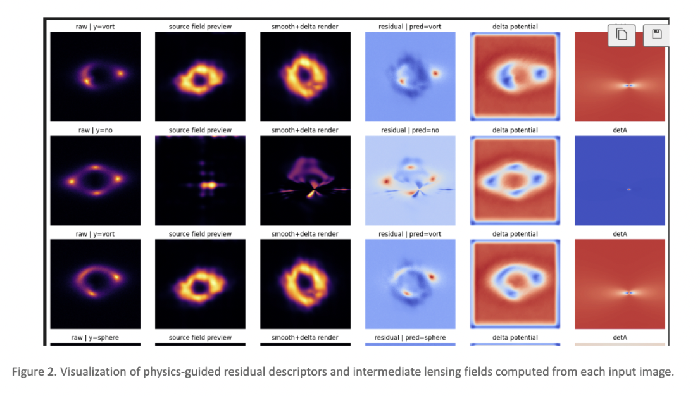

# DeepLense Common Test I — Multi-Class Classification

PyTorch solution for **DeepLense Common Test I** on strong gravitational lensing images.

This repository contains my notebook-based solution for the three-class classification task with labels:

- `no`
- `sphere`
- `vort`

The final submission uses a **physics-informed DenseNet161** pipeline designed for **150×150 grayscale lensing images**, with a fresh **stratified 90:10 split** rebuilt from the full labeled dataset.

---

## Task

The goal is to classify normalized lensing images into three classes and evaluate the model using:

- **ROC curves**
- **AUC score**

The implementation is written in **PyTorch** and organized as a set of notebooks covering the main submission model and supporting ablations.

---

## Final Submission Approach

The main submission notebook is:

- `physics-informed-densenet.ipynb`

The final approach is a **DenseNet161-based classifier** with a lightweight physics-guided input representation.

Instead of feeding only the raw grayscale image, the model builds a **3-channel input stack**:

1. an intensity-enhanced raw view,
2. a physics-inspired edge-like channel,
3. a residual channel that emphasizes local deviations from smoother lens structure.

These channels are then passed into a pretrained **DenseNet161** backbone adapted for small images. In the current code, the initial DenseNet stem is changed from the usual large ImageNet-style entry convolution to a **3×3, stride-1** stem so that fine substructure is preserved more effectively at 150×150 resolution.

The final evaluation setting in the notebook uses:

- the best saved checkpoint,
- **D4 test-time augmentation**,
- multi-class ROC/AUC reporting,
- confusion matrix and prediction export.

---

## Model Overview



*High-level view of the final submission pipeline. Physics is injected before classification through the input representation, while the classifier remains a stable DenseNet-based model.*

---

## Why this design

A standard DenseNet baseline already performs strongly on this task, but the final model improves on that baseline by adding physically meaningful structure **before** feature extraction.

This design helps the model use both:

- **global morphology** of arcs and rings,
- **localized perturbations** associated with substructure.

The goal was to keep the final system strong and practical instead of making the pipeline overly dependent on fragile inverse-reconstruction steps.

---

## Physics-Guided Representation



*Examples of the qualitative physics-guided descriptors used in the pipeline. The transformed raw channel preserves the global lens structure, while the additional channels emphasize sharper local structure and residual deviations.*

---

## Results

### Main submission result

From the final evaluation path in `physics-informed-densenet.ipynb`:

- **Accuracy:** `0.9731`
- **Macro F1:** `0.9731`
- **Macro OvR AUC:** `0.9976`

This corresponds to the selected final setting:

- **best checkpoint + D4 TTA**

### Supporting ablations

This repository also includes supporting experiments that show the progression toward the final model:

| Notebook | Role | Accuracy | Macro AUC |
|---|---|---:|---:|
| `physics-informed-densenet.ipynb` | Main submission | 0.9731 | 0.9976 |
| `densenet_run_best.ipynb` | Strong DenseNet baseline | 0.95 | 0.9919 |
| `lenspinn-dense-correct (1).ipynb` | Hybrid physics + DenseNet ablation | 0.9287 | 0.9872 |
| `lenspinn-accurate.ipynb` | Faithful LensPINN-style recreation | 0.5736 | 0.7463 |

The final submission notebook is the one I would recommend judges focus on first.

---

## Repository Structure

```text
.
├── README.md
├── assets/
│   ├── model-overview.png
│   └── physics-guided-features.png
├── physics-informed-densenet.ipynb
├── densenet_run_best.ipynb
├── lenspinn-dense-correct (1).ipynb
├── lenspinn-accurate.ipynb
└── requirements.txt
