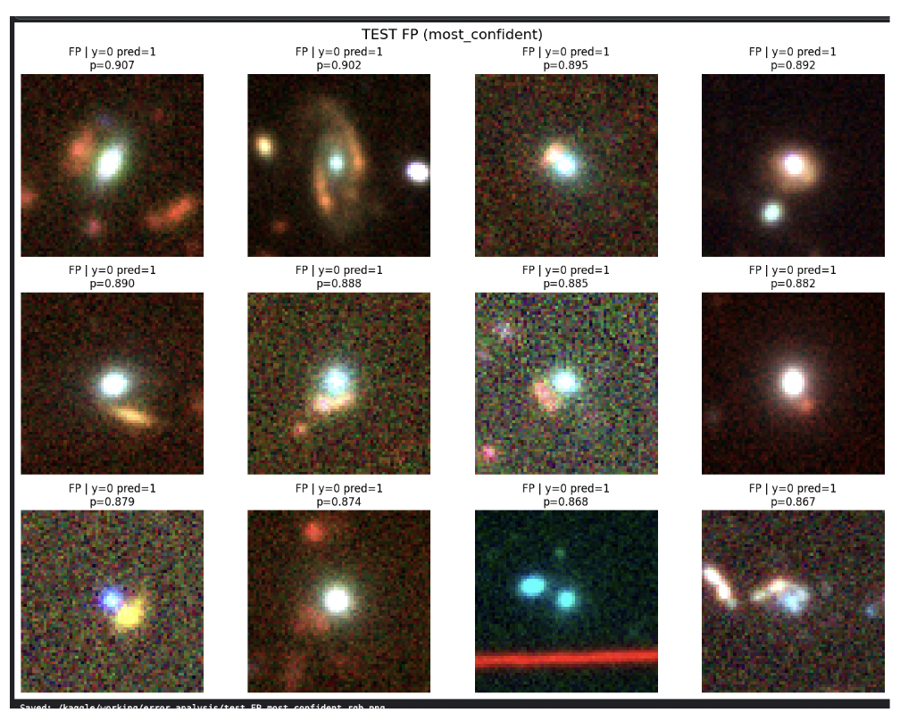
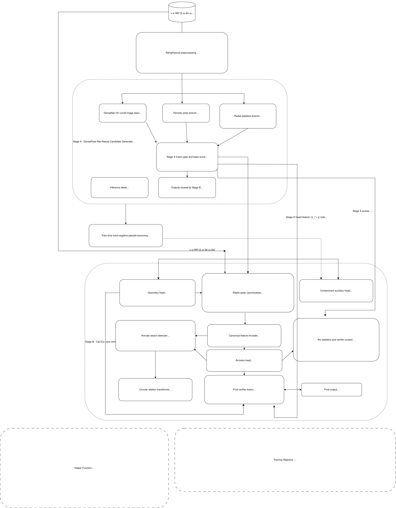

# DeepLense Specific Test V — Lens Finding & Data Pipelines

PyTorch notebook series for **DeepLense Specific Test V: Lens Finding & Data Pipelines**.

This repository studies **binary classification of strong gravitational lenses vs non-lenses** from **3-band observational cutouts** with shape **(3, 64, 64)**. The task is not only to achieve a strong ROC-AUC, but to build a model that remains useful in the **rare-positive regime**, where the real bottleneck is often **false-positive contamination** rather than raw ranking alone.

The work in this repository is organized as a staged progression:

1. an initial **DensePolarNet** baseline,
2. a stronger and more practical **DensePolarNet-Robust** benchmark,
3. a **hard-negative mining (HNM)** ablation,
4. and a research-style **Stage B verifier**, **CaLiCo-Lens**, designed to reduce contamination by reasoning about geometry and structured contaminant families.

---

## Task Summary

The official task is:

- train on `train_lenses` and `train_nonlenses`
- evaluate on `test_lenses` and `test_nonlenses`
- use the 3-band observational arrays directly
- report **ROC curve** and **AUC score**

In practice, this task is more than ordinary binary classification.  
A useful lens finder should return a **short, believable candidate list**, which means it must stay strong at **very low false-positive rates**.

---

## Main Idea of the Repository

The central idea behind this repository is:

> build a strong morphology-aware benchmark first,  
> then study where it fails,  
> then use those failure modes to motivate a better second-stage verifier.

The key observation from my experiments is that the strongest false positives are **not random**. They cluster into recurring contaminant families such as:

- spirals,
- mergers,
- close pairs,
- compact bright galaxies with nearby sources,
- ring-like systems,
- artifact-like cases.

That insight changed the research direction from:

- “train harder on difficult negatives”

to:

- “model structured contaminants and verify lens-consistency explicitly.”

---

## Main Results

| Run | Threshold | ROC-AUC | PR-AUC | Precision | Recall | F1 | MCC | False Positives |
|---|---:|---:|---:|---:|---:|---:|---:|---:|
| `specific-test-v (1).ipynb` — DensePolarNet | 0.70 | 0.9820 | — | 0.3186 | 0.8872 | 0.4707 | 0.5028 | 370 |
| `specific-test-v-2 (1).ipynb` — DensePolarNet-Robust 3-seed ensemble | 0.81 | **0.9906** | **0.7831** | **0.5705** | 0.8718 | **0.6897** | **0.7018** | **128** |
| `hnm-one-seed.ipynb` — hard-negative mining ablation | 0.69 | 0.9881 | 0.8025 | 0.5212 | 0.8821 | 0.6552 | 0.6741 | 158 |
| `calcioco-lens.ipynb` — CaLiCo-Lens Stage B verifier | 0.785 | 0.9898 | 0.7754 | 0.5407 | 0.8513 | 0.6614 | 0.6746 | 141 |

### Main operational result
The best practical benchmark in this repository is:

**DensePolarNet-Robust fixed-split 3-seed ensemble**
- **ROC-AUC:** 0.9906
- **PR-AUC:** 0.7831
- **Threshold:** 0.81
- **TP / FP:** 170 / 128

### Main research extension
The main prototype / future-work direction is:

**CaLiCo-Lens (Contaminant-Aware Lens-Consistency Network)**  
a geometry-aware Stage B verifier designed to reduce false positives by checking annular consistency and contaminant similarity.

---

## Dataset and Split Protocol

Each sample is a **3-band `.npy` cutout** with shape `(3, 64, 64)`.

The original folders are:
- `train_lenses`
- `train_nonlenses`
- `test_lenses`
- `test_nonlenses`

The notebooks keep the **provided test split untouched** and create an **internal 90:10 split** inside the provided training set.

### Effective split counts used in the notebooks

| Split | Lenses | Non-lenses | Lens fraction |
|---|---:|---:|---:|
| Provided train | 1,730 | 28,675 | 5.69% |
| Internal validation | 173 | 2,868 | 5.69% |
| Held-out test | 195 | 19,455 | 0.99% |

This **rare-positive shift** is the key practical difficulty: the test set contains only about **0.99% lenses**, so a model that looks strong on validation can still fail when deployed.

---

## Repository Structure

```text
.
├── README.md
├── assets/
│   ├── contaminant-false-positives.png
│   └── calico-lens-prototype.svg
├── specific-test-v (1).ipynb
├── specific-test-v-2 (1).ipynb
├── hnm-one-seed.ipynb
├── calcioco-lens.ipynb
├── data-testing-and-playing.ipynb
└── requirements.txt
```

---

## Notebook Roles

### `specific-test-v (1).ipynb`
Initial **DensePolarNet** notebook.

This notebook establishes the first serious lens-finding baseline:
- DenseNet backbone
- polar view branch
- radial profile branch using **radial mean only**
- focal loss + D4 TTA

It already shows that the polar / morphology-aware idea is useful, but false positives remain too high.

---

### `specific-test-v-2 (1).ipynb`
Main **DensePolarNet-Robust** benchmark notebook.

This is the strongest operational result in the repository and the main benchmark I would want judges to focus on first.

It upgrades the initial idea through:
- **DenseNet-161**
- **small-image stem** (`3×3`, stride 1, no initial max-pool)
- **periodic polar branch** with circular padding in angle
- **radial mean + radial std**
- astronomy-aware preprocessing
- morphology-preserving augmentation
- **AdamW + cosine schedule**
- **AMP**
- **gradient clipping**
- **EMA**
- **D4 TTA**
- fixed-split **3-seed ensemble** with seeds `42`, `1337`, `2029`

---

### `hnm-one-seed.ipynb`
Single-seed **hard-negative mining (HNM)** ablation.

This notebook starts from a single-seed Stage-A benchmark and explicitly mines high-scoring non-lenses from the training split, then retrains with those negatives upweighted.

Important implementation details:
- top **3%** hardest train non-lenses
- capped at **1200** mined examples
- minimum score floor **0.20**
- fallback minimum **128**
- sampled with weight multiplier **×6**

This experiment was scientifically useful, but it did **not** become the final model.

---

### `calcioco-lens.ipynb`
**CaLiCo-Lens** prototype notebook.

This notebook implements a **Stage B geometry-aware verifier** on top of a frozen Stage-A benchmark.

It is not presented as the main finished benchmark.  
It is presented as the **research prototype / future-work direction** motivated by the benchmark’s failure modes.

---

### `data-testing-and-playing.ipynb`
Utility / inspection notebook.

Used for:
- viewing samples,
- checking filters and bands,
- augmentation inspection,
- class galleries,
- qualitative data understanding.

---

# Phase 1 — DensePolarNet

The first DensePolarNet model was built around a simple physical intuition:

- in Cartesian coordinates, arcs and rings can be curved and appear at many orientations
- in polar coordinates, ring-like structure becomes more regular
- a radial profile can summarize how much signal appears at each radius

The initial model therefore used:
- a Cartesian DenseNet branch,
- a polar branch,
- and a radial branch based on **mean signal over angle**

This worked well enough to establish the basic idea, but it was still less expressive for incomplete arcs and partial rings.

---

# Phase 2 — DensePolarNet-Robust (Main Benchmark)

DensePolarNet-Robust is the strongest operational deliverable in this repository.

## Why it is stronger

Compared with the first DensePolarNet notebook, the robust version improves both the physics idea and the engineering:

### 1. DenseNet-161 small-image stem
The backbone is upgraded to **DenseNet-161** and adapted for small 64×64 cutouts:
- first convolution becomes `3×3`
- stride becomes `1`
- initial max-pooling is removed

This preserves faint arc-like structure that could otherwise disappear early.

### 2. Periodic polar branch
The polar representation is treated correctly as **periodic in angle**:
- angular dimension uses **circular padding**
- radial dimension uses **non-periodic replicate padding**

This avoids the artificial seam that a plain Cartesian-style CNN can create in polar space.

### 3. Radial mean + radial std
The radial branch no longer uses only the mean over angle.

It uses:
- radial mean
- radial standard deviation

This matters because:
- a full ring and a broken arc do not behave the same way
- a partial arc may not increase the mean enough
- but it often increases angular variability

So the standard deviation helps capture **incomplete or anisotropic annular structure**.

### 4. Astronomy-aware preprocessing
The preprocessing pipeline uses:
- per-band nonnegative clipping
- **asinh stretch**
- robust post-normalization by percentiles

This compresses bright cores while preserving faint arc-like structure.

### 5. Practical training choices
The notebook is designed for a **Kaggle P100 16 GB GPU** and uses:
- `memory_efficient=True` in DenseNet
- AMP mixed precision
- careful validation under inference mode
- small batch size
- EMA
- D4 TTA
- fixed-split 3-seed ensemble

---

## Why DenseNet was the right starting point

DenseNet is a good fit for this task because:
- the images are small,
- the signal is mostly morphological,
- and lensing structure depends on both faint local edges and larger annular geometry.

DenseNet’s dense connectivity makes it useful for combining:
- low-level details like thin arcs and faint edges,
- with higher-level morphology like rings and tangential structure.

---

# Hard-Negative Mining (HNM) Ablation

After the strong benchmark, I tested whether a straightforward hard-negative mining strategy could reduce false positives.

The idea was:
1. train a strong single-seed Stage-A model,
2. score the train non-lenses,
3. mine the highest-scoring ones,
4. upweight them during retraining.

This helped answer an important question:

> are the false positives only a sampling problem,  
> or do they need more structured modeling?

## Outcome
The HNM run reached:
- **ROC-AUC:** 0.9881
- **PR-AUC:** 0.8025
- **Precision:** 0.5212
- **Recall:** 0.8821
- **F1:** 0.6552
- **FP:** 158

The result was useful, but it did **not** beat the cleaner main benchmark.

## Interpretation
Plain hard-negative mining tells the model **which negatives are difficult**, but not **why** they are difficult.

That failure was useful because it motivated the next step:
instead of treating all non-lenses as one background class, build a model that can reason about **structured contaminant families**.

---

# Contaminant Taxonomy and False-Positive Analysis

The strongest false positives are not random. They often fall into recurring families such as:

- spirals,
- close pairs,
- mergers,
- compact bright galaxies with nearby sources,
- ring-like non-lens systems,
- artifact-like cases.

That means a practical lens finder should not treat all non-lenses as one uniform background.

## Most confident false positives

The following image should appear **right here**, because this section explains the contaminant families that motivated the Stage B verifier:



*Most confident false positives from the DensePolarNet-Robust benchmark. These examples show that hard negatives cluster into recurring contaminant families rather than appearing randomly, which motivated moving from naive hard-negative mining toward a structured contaminant-aware verifier.*

## Why this section matters
This is the turning point of the repository.

The main lesson was not only:
- “the benchmark is strong”

but also:
- “the strongest errors are structured and scientifically meaningful.”

That is exactly what motivated the move from:
- plain binary classification,
- to **candidate generation + geometry-aware verification**.

---

# Stage B Research Prototype — CaLiCo-Lens

## What CaLiCo-Lens is

**CaLiCo-Lens** stands for:

**Contaminant-Aware Lens-Consistency Network**

It is a **Stage B verifier** built on top of the Stage-A DensePolarNet-Robust candidate generator.

It is **not** presented as the main benchmark result.  
It is presented as the most interesting prototype / future-work direction.

## Core idea

Stage A asks:
- does this object look lens-like?

CaLiCo asks a stronger question:
- if this were a real lens, can I find a plausible center and annular geometry where the object becomes coherent,
- while also checking whether it resembles a structured contaminant family?

So the research move is:

- from appearance-only ranking,
- to **geometry-aware and contaminant-aware verification**.

---

## CaLiCo-Lens components

From the notebook implementation, the Stage B verifier includes:

### 1. Stage A feature extractor
A frozen Stage-A DensePolarNet-Robust is used to provide:
- a baseline morphology score,
- fused morphology features,
- radial profile information.

### 2. Geometry head
A geometry head predicts a compact lens-centered parameterization:
- `dx`
- `dy`
- `r0`
- `q`
- `phi`

These define an approximate annular geometry.

### 3. Elliptic-polar canonicalizer
Using the predicted geometry, the image is transformed into an **elliptic-polar coordinate frame** centered on the candidate lens.

The intuition is:
- true lenses should become more coherent in a correct annular frame
- contaminants usually do not become equally organized

### 4. Canonical polar encoder + arcness head
The canonicalized image is processed by a compact polar encoder, and an arcness head estimates whether the transformed view contains consistent annular evidence.

### 5. Sector tokenizer + angular relation transformer
The annulus is divided into angular sectors, and a transformer reasons about whether those sectors behave like related pieces of the same lens structure or like unrelated bright clutter.

### 6. Contaminant head
Instead of treating all non-lenses as one class, CaLiCo includes a contaminant auxiliary head trained on a pseudo-taxonomy derived from hard negatives.

In the notebook, these contaminant families are built by clustering hard negatives in Stage-A feature space.

### 7. Final verifier head
The final score fuses:
- Stage-A morphology embedding,
- geometry prediction,
- annular relation signal,
- contaminant-aware cues,
- and auxiliary ring / entropy / base-score summaries.

---

## Why CaLiCo-Lens is interesting

CaLiCo-Lens directly addresses the real failure mode of observational lens finding:
- false positives that are visually meaningful,
- not random background noise.

The prototype is therefore valuable even though it does not beat the strongest 3-seed benchmark in raw ROC-AUC.

It gives a better framing for future work:
- candidate purity,
- contaminant-aware reasoning,
- geometry consistency,
- and better interpretation of why a candidate is or is not plausible.

---

## CaLiCo-Lens prototype diagram

The SVG should appear **right here**, directly after the CaLiCo-Lens explanation:



*CaLiCo-Lens prototype. Stage A provides strong morphology features and a baseline lens score. Stage B adds geometry prediction, elliptic-polar canonicalization, annular relation reasoning, and contaminant-aware verification before producing a refined lens score.*

## Why this figure belongs here
This is the most natural place for the SVG because the reader first understands:
- why a second stage is needed,
- what CaLiCo is trying to solve,
- and then sees the full prototype layout.

---
# DeepLense Specific Test V — Lens Finding & Data Pipelines

PyTorch notebook series for **DeepLense Specific Test V: Lens Finding & Data Pipelines**.

This repository studies **binary classification of strong gravitational lenses vs non-lenses** from **3-band observational cutouts** with shape **(3, 64, 64)**. The task is not only to achieve a strong ROC-AUC, but to build a model that remains useful in the **rare-positive regime**, where the real bottleneck is often **false-positive contamination** rather than raw ranking alone.

The work in this repository is organized as a staged progression:

1. an initial **DensePolarNet** baseline,
2. a stronger and more practical **DensePolarNet-Robust** benchmark,
3. a **hard-negative mining (HNM)** ablation,
4. and a research-style **Stage B verifier**, **CaLiCo-Lens**, designed to reduce contamination by reasoning about geometry and structured contaminant families.

---

## Task Summary

The official task is:

- train on `train_lenses` and `train_nonlenses`
- evaluate on `test_lenses` and `test_nonlenses`
- use the 3-band observational arrays directly
- report **ROC curve** and **AUC score**

In practice, this task is more than ordinary binary classification.  
A useful lens finder should return a **short, believable candidate list**, which means it must stay strong at **very low false-positive rates**.

---

## Main Idea of the Repository

The central idea behind this repository is:

> build a strong morphology-aware benchmark first,  
> then study where it fails,  
> then use those failure modes to motivate a better second-stage verifier.

The key observation from my experiments is that the strongest false positives are **not random**. They cluster into recurring contaminant families such as:

- spirals,
- mergers,
- close pairs,
- compact bright galaxies with nearby sources,
- ring-like systems,
- artifact-like cases.

That insight changed the research direction from:

- “train harder on difficult negatives”

to:

- “model structured contaminants and verify lens-consistency explicitly.”

---

## Main Results

| Run | Threshold | ROC-AUC | PR-AUC | Precision | Recall | F1 | MCC | False Positives |
|---|---:|---:|---:|---:|---:|---:|---:|---:|
| `specific-test-v (1).ipynb` — DensePolarNet | 0.70 | 0.9820 | — | 0.3186 | 0.8872 | 0.4707 | 0.5028 | 370 |
| `specific-test-v-2 (1).ipynb` — DensePolarNet-Robust 3-seed ensemble | 0.81 | **0.9906** | **0.7831** | **0.5705** | 0.8718 | **0.6897** | **0.7018** | **128** |
| `hnm-one-seed.ipynb` — hard-negative mining ablation | 0.69 | 0.9881 | 0.8025 | 0.5212 | 0.8821 | 0.6552 | 0.6741 | 158 |
| `calcioco-lens.ipynb` — CaLiCo-Lens Stage B verifier | 0.785 | 0.9898 | 0.7754 | 0.5407 | 0.8513 | 0.6614 | 0.6746 | 141 |

### Main operational result
The best practical benchmark in this repository is:

**DensePolarNet-Robust fixed-split 3-seed ensemble**
- **ROC-AUC:** 0.9906
- **PR-AUC:** 0.7831
- **Threshold:** 0.81
- **TP / FP:** 170 / 128

### Main research extension
The main prototype / future-work direction is:

**CaLiCo-Lens (Contaminant-Aware Lens-Consistency Network)**  
a geometry-aware Stage B verifier designed to reduce false positives by checking annular consistency and contaminant similarity.

---

## Dataset and Split Protocol

Each sample is a **3-band `.npy` cutout** with shape `(3, 64, 64)`.

The original folders are:
- `train_lenses`
- `train_nonlenses`
- `test_lenses`
- `test_nonlenses`

The notebooks keep the **provided test split untouched** and create an **internal 90:10 split** inside the provided training set.

### Effective split counts used in the notebooks

| Split | Lenses | Non-lenses | Lens fraction |
|---|---:|---:|---:|
| Provided train | 1,730 | 28,675 | 5.69% |
| Internal validation | 173 | 2,868 | 5.69% |
| Held-out test | 195 | 19,455 | 0.99% |

This **rare-positive shift** is the key practical difficulty: the test set contains only about **0.99% lenses**, so a model that looks strong on validation can still fail when deployed.

---

## Repository Structure

```text
.
├── README.md
├── assets/
│   ├── contaminant-false-positives.png
│   └── calico-lens-prototype.svg
├── specific-test-v (1).ipynb
├── specific-test-v-2 (1).ipynb
├── hnm-one-seed.ipynb
├── calcioco-lens.ipynb
├── data-testing-and-playing.ipynb
└── requirements.txt
```

---

## Notebook Roles

### `specific-test-v (1).ipynb`
Initial **DensePolarNet** notebook.

This notebook establishes the first serious lens-finding baseline:
- DenseNet backbone
- polar view branch
- radial profile branch using **radial mean only**
- focal loss + D4 TTA

It already shows that the polar / morphology-aware idea is useful, but false positives remain too high.

---

### `specific-test-v-2 (1).ipynb`
Main **DensePolarNet-Robust** benchmark notebook.

This is the strongest operational result in the repository and the main benchmark I would want judges to focus on first.

It upgrades the initial idea through:
- **DenseNet-161**
- **small-image stem** (`3×3`, stride 1, no initial max-pool)
- **periodic polar branch** with circular padding in angle
- **radial mean + radial std**
- astronomy-aware preprocessing
- morphology-preserving augmentation
- **AdamW + cosine schedule**
- **AMP**
- **gradient clipping**
- **EMA**
- **D4 TTA**
- fixed-split **3-seed ensemble** with seeds `42`, `1337`, `2029`

---

### `hnm-one-seed.ipynb`
Single-seed **hard-negative mining (HNM)** ablation.

This notebook starts from a single-seed Stage-A benchmark and explicitly mines high-scoring non-lenses from the training split, then retrains with those negatives upweighted.

Important implementation details:
- top **3%** hardest train non-lenses
- capped at **1200** mined examples
- minimum score floor **0.20**
- fallback minimum **128**
- sampled with weight multiplier **×6**

This experiment was scientifically useful, but it did **not** become the final model.

---

### `calcioco-lens.ipynb`
**CaLiCo-Lens** prototype notebook.

This notebook implements a **Stage B geometry-aware verifier** on top of a frozen Stage-A benchmark.

It is not presented as the main finished benchmark.  
It is presented as the **research prototype / future-work direction** motivated by the benchmark’s failure modes.

---

### `data-testing-and-playing.ipynb`
Utility / inspection notebook.

Used for:
- viewing samples,
- checking filters and bands,
- augmentation inspection,
- class galleries,
- qualitative data understanding.

---

# Phase 1 — DensePolarNet

The first DensePolarNet model was built around a simple physical intuition:

- in Cartesian coordinates, arcs and rings can be curved and appear at many orientations
- in polar coordinates, ring-like structure becomes more regular
- a radial profile can summarize how much signal appears at each radius

The initial model therefore used:
- a Cartesian DenseNet branch,
- a polar branch,
- and a radial branch based on **mean signal over angle**

This worked well enough to establish the basic idea, but it was still less expressive for incomplete arcs and partial rings.

---

# Phase 2 — DensePolarNet-Robust (Main Benchmark)

DensePolarNet-Robust is the strongest operational deliverable in this repository.

## Why it is stronger

Compared with the first DensePolarNet notebook, the robust version improves both the physics idea and the engineering:

### 1. DenseNet-161 small-image stem
The backbone is upgraded to **DenseNet-161** and adapted for small 64×64 cutouts:
- first convolution becomes `3×3`
- stride becomes `1`
- initial max-pooling is removed

This preserves faint arc-like structure that could otherwise disappear early.

### 2. Periodic polar branch
The polar representation is treated correctly as **periodic in angle**:
- angular dimension uses **circular padding**
- radial dimension uses **non-periodic replicate padding**

This avoids the artificial seam that a plain Cartesian-style CNN can create in polar space.

### 3. Radial mean + radial std
The radial branch no longer uses only the mean over angle.

It uses:
- radial mean
- radial standard deviation

This matters because:
- a full ring and a broken arc do not behave the same way
- a partial arc may not increase the mean enough
- but it often increases angular variability

So the standard deviation helps capture **incomplete or anisotropic annular structure**.

### 4. Astronomy-aware preprocessing
The preprocessing pipeline uses:
- per-band nonnegative clipping
- **asinh stretch**
- robust post-normalization by percentiles

This compresses bright cores while preserving faint arc-like structure.

### 5. Practical training choices
The notebook is designed for a **Kaggle P100 16 GB GPU** and uses:
- `memory_efficient=True` in DenseNet
- AMP mixed precision
- careful validation under inference mode
- small batch size
- EMA
- D4 TTA
- fixed-split 3-seed ensemble

---

## Why DenseNet was the right starting point

DenseNet is a good fit for this task because:
- the images are small,
- the signal is mostly morphological,
- and lensing structure depends on both faint local edges and larger annular geometry.

DenseNet’s dense connectivity makes it useful for combining:
- low-level details like thin arcs and faint edges,
- with higher-level morphology like rings and tangential structure.

---

# Hard-Negative Mining (HNM) Ablation

After the strong benchmark, I tested whether a straightforward hard-negative mining strategy could reduce false positives.

The idea was:
1. train a strong single-seed Stage-A model,
2. score the train non-lenses,
3. mine the highest-scoring ones,
4. upweight them during retraining.

This helped answer an important question:

> are the false positives only a sampling problem,  
> or do they need more structured modeling?

## Outcome
The HNM run reached:
- **ROC-AUC:** 0.9881
- **PR-AUC:** 0.8025
- **Precision:** 0.5212
- **Recall:** 0.8821
- **F1:** 0.6552
- **FP:** 158

The result was useful, but it did **not** beat the cleaner main benchmark.

## Interpretation
Plain hard-negative mining tells the model **which negatives are difficult**, but not **why** they are difficult.

That failure was useful because it motivated the next step:
instead of treating all non-lenses as one background class, build a model that can reason about **structured contaminant families**.

---

# Contaminant Taxonomy and False-Positive Analysis

The strongest false positives are not random. They often fall into recurring families such as:

- spirals,
- close pairs,
- mergers,
- compact bright galaxies with nearby sources,
- ring-like non-lens systems,
- artifact-like cases.

That means a practical lens finder should not treat all non-lenses as one uniform background.

## Most confident false positives

The following image should appear **right here**, because this section explains the contaminant families that motivated the Stage B verifier:


*Most confident false positives from the DensePolarNet-Robust benchmark. These examples show that hard negatives cluster into recurring contaminant families rather than appearing randomly, which motivated moving from naive hard-negative mining toward a structured contaminant-aware verifier.*

## Why this section matters
This is the turning point of the repository.

The main lesson was not only:
- “the benchmark is strong”

but also:
- “the strongest errors are structured and scientifically meaningful.”

That is exactly what motivated the move from:
- plain binary classification,
- to **candidate generation + geometry-aware verification**.

---

# Stage B Research Prototype — CaLiCo-Lens

## What CaLiCo-Lens is

**CaLiCo-Lens** stands for:

**Contaminant-Aware Lens-Consistency Network**

It is a **Stage B verifier** built on top of the Stage-A DensePolarNet-Robust candidate generator.

It is **not** presented as the main benchmark result.  
It is presented as the most interesting prototype / future-work direction.

## Core idea

Stage A asks:
- does this object look lens-like?

CaLiCo asks a stronger question:
- if this were a real lens, can I find a plausible center and annular geometry where the object becomes coherent,
- while also checking whether it resembles a structured contaminant family?

So the research move is:

- from appearance-only ranking,
- to **geometry-aware and contaminant-aware verification**.

---

## CaLiCo-Lens components

From the notebook implementation, the Stage B verifier includes:

### 1. Stage A feature extractor
A frozen Stage-A DensePolarNet-Robust is used to provide:
- a baseline morphology score,
- fused morphology features,
- radial profile information.

### 2. Geometry head
A geometry head predicts a compact lens-centered parameterization:
- `dx`
- `dy`
- `r0`
- `q`
- `phi`

These define an approximate annular geometry.

### 3. Elliptic-polar canonicalizer
Using the predicted geometry, the image is transformed into an **elliptic-polar coordinate frame** centered on the candidate lens.

The intuition is:
- true lenses should become more coherent in a correct annular frame
- contaminants usually do not become equally organized

### 4. Canonical polar encoder + arcness head
The canonicalized image is processed by a compact polar encoder, and an arcness head estimates whether the transformed view contains consistent annular evidence.

### 5. Sector tokenizer + angular relation transformer
The annulus is divided into angular sectors, and a transformer reasons about whether those sectors behave like related pieces of the same lens structure or like unrelated bright clutter.

### 6. Contaminant head
Instead of treating all non-lenses as one class, CaLiCo includes a contaminant auxiliary head trained on a pseudo-taxonomy derived from hard negatives.

In the notebook, these contaminant families are built by clustering hard negatives in Stage-A feature space.

### 7. Final verifier head
The final score fuses:
- Stage-A morphology embedding,
- geometry prediction,
- annular relation signal,
- contaminant-aware cues,
- and auxiliary ring / entropy / base-score summaries.

---

## Why CaLiCo-Lens is interesting

CaLiCo-Lens directly addresses the real failure mode of observational lens finding:
- false positives that are visually meaningful,
- not random background noise.

The prototype is therefore valuable even though it does not beat the strongest 3-seed benchmark in raw ROC-AUC.

It gives a better framing for future work:
- candidate purity,
- contaminant-aware reasoning,
- geometry consistency,
- and better interpretation of why a candidate is or is not plausible.

---

## CaLiCo-Lens prototype diagram

The SVG should appear **right here**, directly after the CaLiCo-Lens explanation:


*CaLiCo-Lens prototype. Stage A provides strong morphology features and a baseline lens score. Stage B adds geometry prediction, elliptic-polar canonicalization, annular relation reasoning, and contaminant-aware verification before producing a refined lens score.*

---

# Honest comparison: benchmark vs research prototype

A clean reading of the repository is:

- **DensePolarNet-Robust** is the main benchmark and strongest practical deliverable
- **HNM** is a useful ablation but not the final direction
- **CaLiCo-Lens** is the research prototype that grows directly from the benchmark’s real failure modes

## Operational benchmark
DensePolarNet-Robust remains the strongest model to submit as the main benchmark:
- strongest overall held-out operational result
- strongest candidate generator
- best balance of ranking quality and contamination control

## Research direction
CaLiCo-Lens is the best future-looking direction:
- geometry-aware
- contaminant-aware
- interpretable
- motivated by actual failure cases rather than arbitrary architecture changes

---

# Recommended reading order for judges

If someone opens this repository for the first time, I recommend this order:

1. `specific-test-v-2 (1).ipynb`
2. `hnm-one-seed.ipynb`
3. `calcioco-lens.ipynb`
4. `specific-test-v (1).ipynb`
5. `data-testing-and-playing.ipynb`

### Why this order
- start with the strongest benchmark
- then see the hard-negative mining ablation
- then see the Stage B research prototype motivated by those errors
- then read the earlier DensePolarNet baseline
- and finally the exploratory data notebook

---

# How to Run

## 1. Prepare the dataset
The notebooks expect the original DeepLense Task V folder structure:

```text
dataset-task-v/
├── train_lenses/
├── train_nonlenses/
├── test_lenses/
└── test_nonlenses/
```

Each file is a 3-band `.npy` cutout with shape `(3, 64, 64)`.

---

## 2. Open the notebook you want to run

Recommended starting points:

- **main benchmark:** `specific-test-v-2 (1).ipynb`
- **hard-negative ablation:** `hnm-one-seed.ipynb`
- **research prototype:** `calcioco-lens.ipynb`

---

## 3. Update dataset paths if needed
Each notebook contains a dataset root finder / configuration block near the top.  
If your folder path is different, update the root there.

---

## 4. Run cells in order
The notebooks are end-to-end workflows for:
- split creation
- preprocessing
- training
- validation
- checkpoint saving
- threshold selection
- ROC / PR evaluation
- confusion matrices
- candidate analysis
- error galleries

---

# What each notebook produces

Depending on the notebook, outputs include:
- checkpoints
- validation threshold tables
- ROC curves
- PR curves
- confusion matrices
- CSV prediction files
- candidate-ranking summaries
- false-positive / false-negative galleries
- contaminant cluster galleries
- prototype verifier outputs

---

# Practical training notes

These notebooks were built for a **Kaggle Tesla P100 16 GB GPU** environment and include practical memory-aware choices:

- DenseNet small-image adaptation
- `memory_efficient=True` in DenseNet where needed
- AMP mixed precision
- small batch sizes
- careful inference mode usage
- explicit cache clearing between heavy stages

The repository is therefore written as a realistic Kaggle-grade pipeline, not as an unlimited-compute experiment.

---

# Final takeaway

This repository is not just a single classifier.

It is a staged lens-finding study that moves through:

- a strong morphology-aware benchmark,
- low-contamination evaluation,
- contaminant analysis,
- hard-negative mining,
- and finally a geometry-aware, contaminant-aware verifier prototype.

So the clean story is:

> first build a strong benchmark candidate generator,  
> then study its failure modes carefully,  
> then design a better second-stage verifier matched to the actual scientific problem.

---


# Honest comparison: benchmark vs research prototype

A clean reading of the repository is:

- **DensePolarNet-Robust** is the main benchmark and strongest practical deliverable
- **HNM** is a useful ablation but not the final direction
- **CaLiCo-Lens** is the research prototype that grows directly from the benchmark’s real failure modes

## Operational benchmark
DensePolarNet-Robust remains the strongest model to submit as the main benchmark:
- strongest overall held-out operational result
- strongest candidate generator
- best balance of ranking quality and contamination control

## Research direction
CaLiCo-Lens is the best future-looking direction:
- geometry-aware
- contaminant-aware
- interpretable
- motivated by actual failure cases rather than arbitrary architecture changes

---

# Recommended reading order for judges

If someone opens this repository for the first time, I recommend this order:

1. `specific-test-v-2 (1).ipynb`
2. `hnm-one-seed.ipynb`
3. `calcioco-lens.ipynb`
4. `specific-test-v (1).ipynb`
5. `data-testing-and-playing.ipynb`

### Why this order
- start with the strongest benchmark
- then see the hard-negative mining ablation
- then see the Stage B research prototype motivated by those errors
- then read the earlier DensePolarNet baseline
- and finally the exploratory data notebook

---

# How to Run

## 1. Prepare the dataset
The notebooks expect the original DeepLense Task V folder structure:

```text
dataset-task-v/
├── train_lenses/
├── train_nonlenses/
├── test_lenses/
└── test_nonlenses/
```

Each file is a 3-band `.npy` cutout with shape `(3, 64, 64)`.

---

## 2. Open the notebook you want to run

Recommended starting points:

- **main benchmark:** `specific-test-v-2 (1).ipynb`
- **hard-negative ablation:** `hnm-one-seed.ipynb`
- **research prototype:** `calcioco-lens.ipynb`

---

## 3. Update dataset paths if needed
Each notebook contains a dataset root finder / configuration block near the top.  
If your folder path is different, update the root there.

---

## 4. Run cells in order
The notebooks are end-to-end workflows for:
- split creation
- preprocessing
- training
- validation
- checkpoint saving
- threshold selection
- ROC / PR evaluation
- confusion matrices
- candidate analysis
- error galleries

---

# What each notebook produces

Depending on the notebook, outputs include:
- checkpoints
- validation threshold tables
- ROC curves
- PR curves
- confusion matrices
- CSV prediction files
- candidate-ranking summaries
- false-positive / false-negative galleries
- contaminant cluster galleries
- prototype verifier outputs

---

# Practical training notes

These notebooks were built for a **Kaggle Tesla P100 16 GB GPU** environment and include practical memory-aware choices:

- DenseNet small-image adaptation
- `memory_efficient=True` in DenseNet where needed
- AMP mixed precision
- small batch sizes
- careful inference mode usage
- explicit cache clearing between heavy stages

The repository is therefore written as a realistic Kaggle-grade pipeline, not as an unlimited-compute experiment.

---

# Final takeaway

This repository is not just a single classifier.

It is a staged lens-finding study that moves through:

- a strong morphology-aware benchmark,
- low-contamination evaluation,
- contaminant analysis,
- hard-negative mining,
- and finally a geometry-aware, contaminant-aware verifier prototype.

So the clean story is:

> first build a strong benchmark candidate generator,  
> then study its failure modes carefully,  
> then design a better second-stage verifier matched to the actual scientific problem.

---

# Image setup for GitHub

For the image links above to render correctly on GitHub:

1. Create a folder named `assets` in the root of the repository.
2. Add these files with **exactly** these names:
   - `assets/contaminant-false-positives.png`
   - `assets/calico-lens-prototype.svg`
3. Keep `README.md` in the repository root.
4. Do not rename the files unless you also update the paths in the README.

Because the README uses **relative paths**, GitHub will render the PNG and SVG automatically after you push.
