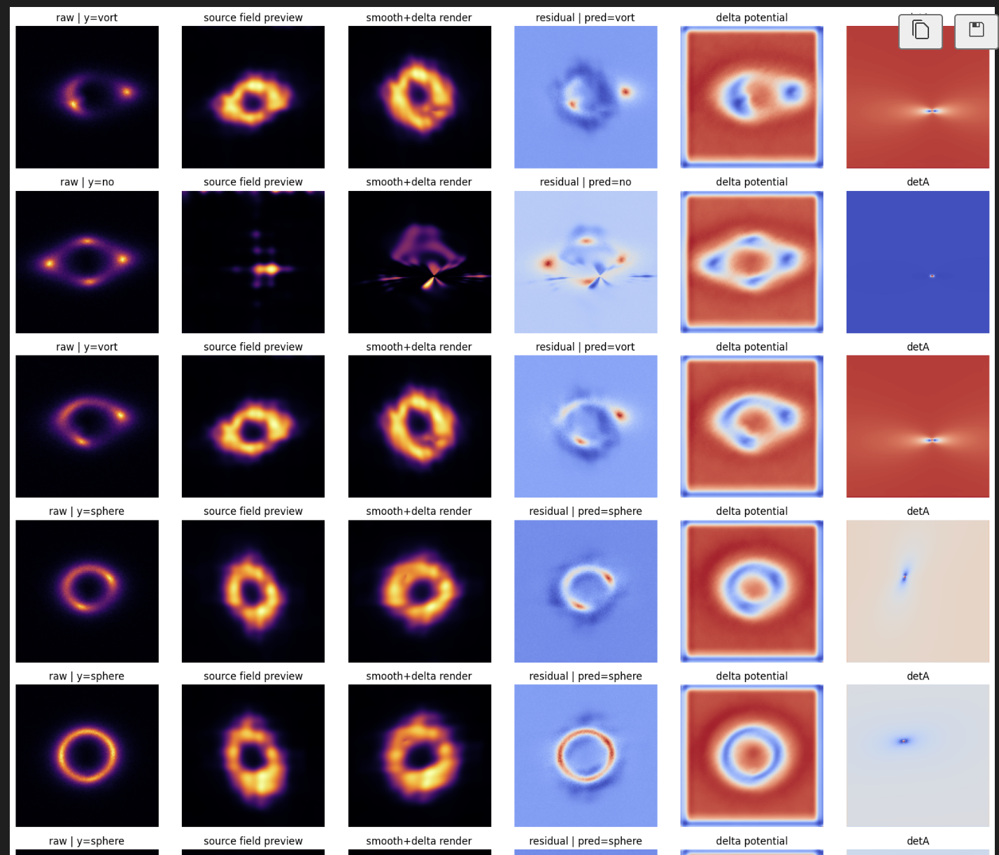
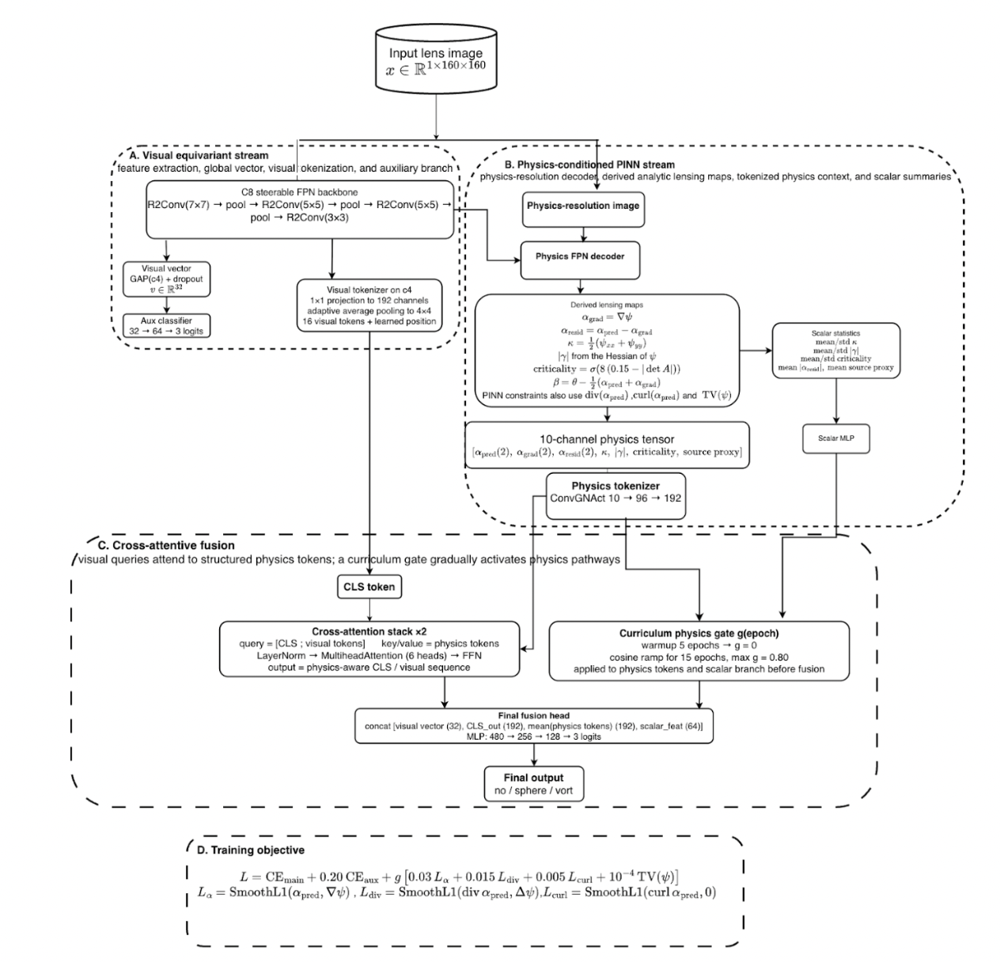
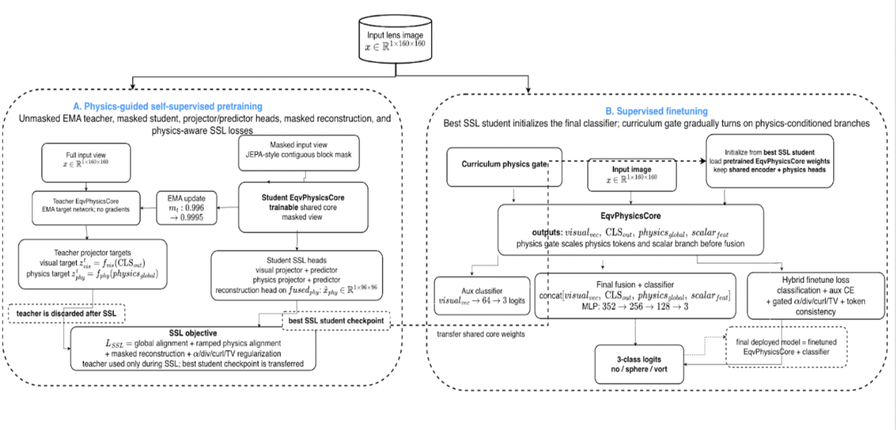

# DeepLense Specific Test VII — Physics-Guided ML

PyTorch notebook series for **DeepLense GSoC Specific Test VII: Physics-Guided ML**.

This repository contains my solution and staged ablation study for **Specific Test VII**, where the goal is not only to classify strong gravitational lensing images into the three classes

- `no`
- `sphere`
- `vort`

but to do so with a **physics informed neural network (PINN)** that uses the **gravitational lensing equation** inside the architecture.

The dataset is the same one used in the Common Task, but the objective here is more specific: build architectures that reason through lensing-related intermediate quantities such as potential-like fields, deflection-like fields, residual lensing structure, and derived maps, instead of treating the task as ordinary image classification.

---

## What this repository is trying to show

This repository is best understood as a **research progression**, not as a single one-off notebook.

The progression is:

1. establish strong **DenseNet-based physics-guided baselines**,
2. test a more explicit non-equivariant **AC-PT-PINN** design,
3. move to a compact **equivariant PINN family**,
4. and finally extend that family into **physics-guided self-supervised representation learning**.

So the main value of the repository is not only the best score from one notebook, but the architecture study showing how different ways of injecting lensing physics affect:

- raw ROC-AUC,
- interpretability,
- parameter count,
- and scientific alignment with the Physics-Guided ML project direction.

---

## Main framing of the notebook series

I frame the notebooks in three layers:

### A. Strong dense physics benchmarks
These are the strongest Task VII raw-scoring notebooks and provide the benchmark ladder for the rest of the study.

### B. Main supervised physics-guided architecture
This is **Tier 2: EQV-AC-PT-PINN**, which I treat as the main supervised architecture to center the proposal and repository around.

### C. Future-looking extension
This is **Tier 3: EQV-PHYS-SSL-ACPT**, which extends the same architecture family into teacher-student self-supervised pretraining and supervised finetuning.

---

## Notebook progression and metric summary

| Notebook | Role | Approx. model family | Accuracy | Macro F1 | Macro AUC |
|---|---|---|---:|---:|---:|
| `task-vii-dataset_best_auc.ipynb` | strongest Task VII dense physics baseline | DenseNet residual-PINN | 0.9701 | 0.9701 | 0.9969 |
| `task-vii_second_best_auc.ipynb` | second strong dense benchmark | DenseNet PINN | 0.9715 | 0.9714 | 0.9966 |
| `ac-pt-pinn.ipynb` | non-equivariant structured physics-token ablation | ConvNeXt + AC-PT PINN | 0.9688 | 0.9687 | 0.9959 |
| `eqv-lenspinn-abilation_I.ipynb` | Tier 1 feasibility baseline | equivariant LensPINN-style PINN | 0.9448 | 0.9446 | 0.9917 |
| `eqv-ac-pt-pinn-abilation_II.ipynb` | **Tier 2 main supervised contribution** | equivariant AC-PT PINN | 0.9557 | 0.9556 | 0.9931 |
| `eqv-phys-ssl-acpt.ipynb` | Tier 3 research extension | equivariant physics-guided SSL + finetune | 0.9603 | 0.9601 | 0.9949 |

### Important note on protocol
These runs are part of a staged notebook study, so the split protocol is not identical across every run.

- The dense Task VII benchmark notebooks rebuild a fresh **90:10** split from the full dataset.
- The later equivariant tier notebooks mostly use the provided `train/` and `val/` folders directly.

Because of that, the table should be read as a **careful notebook audit and research progression**, not as a perfectly controlled apples-to-apples leaderboard.

---

## Repository structure

```text
.
├── README.md
├── assets/
│   ├── task7-tier2-eqv-ac-pt-pinn.png
│   ├── task7-tier3-eqv-phys-ssl-acpt.png
│   └── task7-residual-descriptors.png
├── task-vii-dataset_best_auc.ipynb
├── task-vii_second_best_auc.ipynb
├── ac-pt-pinn.ipynb
├── eqv-lenspinn-abilation_I.ipynb
├── eqv-ac-pt-pinn-abilation_II.ipynb
├── eqv-phys-ssl-acpt.ipynb
└── requirements.txt
```

---

## Dataset

The dataset contains normalized strong lensing images from three classes:

- no substructure
- sphere-like substructure
- vortex-like substructure

Typical folder structure:

```text
dataset/
├── train/
│   ├── no/
│   ├── sphere/
│   └── vort/
└── val/
    ├── no/
    ├── sphere/
    └── vort/
```

Some notebooks use these folders directly. Others merge them and rebuild a fresh **stratified 90:10 split**.

---

# Dense physics-guided baselines

## 1) `task-vii-dataset_best_auc.ipynb`
### Strongest Task VII DenseNet residual-PINN benchmark

This notebook is the strongest **Task VII-specific dense physics benchmark** in the repository.

It combines a strong DenseNet-style vision backbone with an explicit residual lensing branch. Instead of only classifying from raw pixel embeddings, it predicts physically meaningful intermediate quantities and then constructs a descriptor stack from them.

### What the notebook is doing
The main model predicts:

- a base DenseNet classification signal,
- smooth lens parameters,
- a latent code for a coordinate-based source field,
- and a residual lensing potential `delta_psi`.

Using finite differences, `delta_psi` is turned into additional deflection terms and added to the smooth macro lens deflection. The model then warps the source field back into image space to produce a rendered image and builds residual physics descriptors such as:

- raw image,
- rendered image,
- residual,
- absolute residual,
- residual gradient,
- determinant-related structure,
- magnification-related maps.

These descriptors are encoded and fused with the dense backbone prediction in a final physics head.

### Why it matters
This notebook is important because it shows the strongest explicit DenseNet-scale Task VII benchmark and also makes the physics side visible through interpretable intermediate maps.

---

## Dense Physics Baseline and Residual Descriptors

The following figure should appear **right here**, directly after the paragraph above and before the next section:



*Visual residual descriptors and intermediate lensing fields from `task-vii-dataset_best_auc.ipynb`. This notebook computes physically meaningful rendered and residual views from each input image instead of relying only on the raw lens image.*

### Why this figure is useful
This figure shows the exact motivation for the dense residual-PINN direction:

- the model does not only see the raw lens,
- it explicitly constructs potential-like and residual descriptors,
- and tries to make the classifier reason through the lensing field itself.

That makes this notebook very useful as a **benchmark and interpretability study**, even if the later research direction moves toward cleaner and lighter architectures.

---

## 2) `task-vii_second_best_auc.ipynb`
### DenseNet PINN with explicit field-style physics pooling

This notebook is the second strong DenseNet benchmark in the Task VII series.

Compared with the heavier residual-rendering notebook above, this version is somewhat cleaner and pushes the model toward explicit field prediction and pooled physics-map fusion.

### Main idea
The notebook builds a multi-channel physics-guided input, runs it through a DenseNet backbone, predicts potential-like and lensing-related maps, derives quantities such as deflection and convergence-related structure, and then pools those physics maps to augment the classifier.

### Why it matters
This notebook is important because it sits between:

- the strong dense benchmark mentality,
- and the later, cleaner physics-token and cross-attention designs.

It helped clarify that explicit physics can help, but also that simply making the architecture heavier is not necessarily the right long-term direction.

---

## 3) `ac-pt-pinn.ipynb`
### Non-equivariant AC-PT-PINN ablation

This notebook is a key bridge between the dense benchmarks and the later equivariant tiers.

It uses a **ConvNeXt-based visual backbone** and combines it with a physics branch that predicts field-like quantities more explicitly, then tokenizes the physics information and fuses it with the visual branch through structured interaction.

### Main idea
This notebook predicts:

- a potential-like field,
- a deflection-like field,
- consistency-related derived maps,
- and a physics token representation built from those maps.

The classifier then uses **cross-attention** or structured fusion between visual evidence and physics-derived tokens instead of only appending a penalty term.

### Why it matters
This notebook helped establish one of the main design lessons of the repository:

> the best use of physics is not only to add a loss term,  
> but to let visual evidence interact with structured physics evidence inside the architecture.

That idea survives into the later equivariant tiers.

---

# Equivariant PINN notebook progression

The later part of the repository moves from dense high-performing baselines toward a lighter, more interpretable, more research-aligned **equivariant PINN family**.

The motivation is simple:

- lensing has meaningful rotational structure,
- symmetry-aware visual backbones are scientifically appropriate,
- and predicting field-like latent quantities tied to the lens equation can make the models more interpretable.

---

## Tier 1 — `eqv-lenspinn-abilation_I.ipynb`
### EQV-LENSPINN feasibility baseline

Tier 1 is the first compact equivariant PINN in the sequence.

Its role is not to be the best-scoring notebook in the repository. Its role is to show that:

- equivariant visual features can be trained stably on this task,
- symmetry-aware design is usable,
- and light lens-equation guidance can be integrated without collapsing training.

### What it contains
Tier 1 combines:

- a C8-equivariant visual trunk,
- a compact physics branch,
- a simple source-plane warp,
- a source decoder,
- scalar lens statistics,
- and a gated fusion head.

### Why Tier 1 matters
Tier 1 is the feasibility proof.  
It establishes that the repository can move away from very heavy dense models toward a compact physics-aware and symmetry-aware architecture family.

---

## Tier 2 — `eqv-ac-pt-pinn-abilation_II.ipynb`
## Main Supervised Architecture (Tier 2: EQV-AC-PT-PINN)

This is the main supervised architecture I would want judges and mentors to read first.

It is the cleanest and most balanced supervised model in the notebook series because it combines:

- equivariant vision,
- explicit field prediction,
- derived physics maps,
- structured visual–physics token fusion,
- and gradual activation of physics losses.

### Why I center the repository around Tier 2
Tier 2 is not the best raw AUC notebook overall, but it is the best **main supervised research architecture** in the later PINN family.

It is the most balanced design because it is:

- more interpretable than the dense baselines,
- far smaller in parameter count,
- explicitly tied to lensing quantities,
- and closer to the kind of scientifically grounded architecture one would want to extend to real lensing data.

### Architecture summary
Tier 2 contains four major pieces:

#### A. Equivariant visual branch
A C8-steerable FPN backbone extracts symmetry-aware image features and produces both:

- global pooled visual features,
- and spatial feature maps for tokenization.

#### B. Physics FPN decoder
A physics branch predicts latent lensing fields such as:

- `psi`,
- `alpha_pred`,
- and derived maps including:
  - `alpha_grad`,
  - `alpha_resid`,
  - convergence-like quantities,
  - shear-related structure,
  - criticality,
  - and a source proxy.

#### C. Tokenized visual–physics interaction
Instead of flattening everything directly, the notebook builds:

- visual tokens,
- physics tokens,
- a CLS token,
- and cross-attention blocks so that the visual stream attends to structured physics evidence.

#### D. Final fusion head
The classifier concatenates:

- visual global vector,
- CLS output,
- pooled physics token representation,
- scalar physics statistics,

and produces the final logits for `no / sphere / vort`.

### Training objective
Tier 2 uses a hybrid training objective with:

- main classification loss,
- auxiliary classification loss,
- alpha consistency,
- divergence consistency,
- curl regularization,
- TV regularization,
- and a curriculum-style physics gate.

The physics gate gradually activates the physics-conditioned pathways rather than forcing all constraints strongly from the first epoch.

---

## Tier 2 diagram

The Tier 2 diagram should appear **right here**, after the explanation above and before Tier 3:



*Tier 2 EQV-AC-PT-PINN architecture. The model uses an equivariant visual branch, a physics field decoder, tokenized visual–physics fusion, and a curriculum gate to gradually activate physics-conditioned components.*

### Why this figure belongs here
This is the main supervised architecture diagram, so it should be shown immediately after the Tier 2 explanation. That way the reader first understands the motivation, then sees the actual system layout.

---

## Tier 3 — `eqv-phys-ssl-acpt.ipynb`
## Physics-Guided Self-Supervised Extension (Tier 3: EQV-PHYS-SSL-ACPT)

Tier 3 is the most novel direction in the repository.

It takes the same compact equivariant physics-aware family and extends it into a **teacher–student self-supervised pretraining stage**, followed by supervised finetuning.

### How Tier 3 is framed
I do **not** frame Tier 3 as the final main claimed solution.

Instead, I frame it as:

- the natural future extension of Tier 2,
- a promising route for reusable lensing representations,
- and a research-forward prototype that improved over Tier 2 inside the compact equivariant family.

### Stage A — physics-guided SSL pretraining
The SSL stage contains:

- an EMA teacher,
- a masked student,
- visual and physics projector/predictor heads,
- masked reconstruction,
- global alignment,
- physics-token alignment,
- and physics-aware regularization terms.

This stage tries to learn a reusable physics-aware encoder before full downstream supervision.

### Stage B — supervised finetuning
The best pretrained student core is transferred into a downstream classifier that reuses the same physics-aware encoder and finetunes it for the `no / sphere / vort` classification task.

The finetuning stage again uses a curriculum gate so that the physics-conditioned branches are turned on gradually.

### Why Tier 3 matters
Tier 3 matters because it suggests that the same physics-aware architecture family can be pushed beyond ordinary supervised classification toward:

- reusable lensing representations,
- transfer learning,
- broader downstream tasks,
- and better parameter efficiency.

---

## Tier 3 diagram

The Tier 3 diagram should appear **right here**, directly after the Tier 3 explanation:



*Tier 3 EQV-PHYS-SSL-ACPT architecture. Stage A performs physics-guided self-supervised pretraining with teacher–student alignment and masked reconstruction. Stage B transfers the pretrained physics-aware core into supervised finetuning.*

### Why this figure belongs here
The reader first sees the supervised Tier 2 architecture, then immediately sees how Tier 3 extends it into a two-stage SSL + finetuning pipeline.

That makes the research progression visually clear.

---

# Recommended reading order for judges

If someone opens this repository for the first time, I recommend reading the notebooks in this order:

1. `eqv-ac-pt-pinn-abilation_II.ipynb`
2. `eqv-phys-ssl-acpt.ipynb`
3. `task-vii-dataset_best_auc.ipynb`
4. `task-vii_second_best_auc.ipynb`
5. `ac-pt-pinn.ipynb`
6. `eqv-lenspinn-abilation_I.ipynb`

### Why this order
- **Tier 2** is the main supervised architecture to understand first.
- **Tier 3** shows the future direction of the same family.
- The dense Task VII notebooks provide the benchmark context.
- `ac-pt-pinn.ipynb` shows the important intermediate design step before the equivariant models.
- Tier 1 explains where the compact family started.

---

# Main scientific takeaways

## 1. Dense physics-guided baselines remain strong
The DenseNet residual-PINN benchmark remains the strongest raw Task VII benchmark in this notebook series.

## 2. Explicit physics is useful, but heavier models are not automatically better
Some more explicit physics-guided models gave useful insight and better interpretability without necessarily beating the strongest dense benchmark in raw ROC-AUC.

## 3. Structured visual–physics interaction is more promising than only adding a penalty term
The later architectures improve conceptually by letting the visual stream interact with structured physics-derived tokens and scalar summaries.

## 4. Equivariant PINNs are promising
The equivariant tier family is much smaller than the DenseNet and ConvNeXt baselines while remaining scientifically meaningful and competitive.

## 5. Tier 2 is the best architecture to center the proposal around
Tier 2 is the strongest validated supervised member of the compact equivariant PINN family and is the best balance of practicality, interpretability, and research value.

## 6. Tier 3 is the correct future-facing extension
Tier 3 shows that the same family can move toward physics-guided representation learning instead of remaining only a supervised classifier.

---

# How to run

## 1. Prepare the dataset
Download and extract the dataset into the standard class-folder layout.

## 2. Open the notebook you want to run
Recommended starting points:

- main supervised architecture: `eqv-ac-pt-pinn-abilation_II.ipynb`
- research extension: `eqv-phys-ssl-acpt.ipynb`
- strongest dense Task VII benchmark: `task-vii-dataset_best_auc.ipynb`

## 3. Update paths
Each notebook contains a configuration section near the top where dataset roots, working directories, and checkpoint/output folders are defined.

## 4. Run cells in order
The notebooks are end-to-end workflows for:

- split creation or folder-based loading,
- training,
- validation,
- checkpoint saving,
- ROC/AUC evaluation,
- confusion matrix generation,
- and prediction export.

---

# Image setup for GitHub

For the diagrams to show up correctly on GitHub, do the following:

1. Create a folder named `assets` in the root of the repository.
2. Save the images with **exactly** these filenames:
   - `task7-tier2-eqv-ac-pt-pinn.png`
   - `task7-tier3-eqv-phys-ssl-acpt.png`
   - `task7-residual-descriptors.png`
3. Keep `README.md` in the repository root.
4. Do not rename the files after pasting this README unless you also update the paths here.
5. Commit and push both the README and the three images.

Because the README uses **relative paths**, GitHub will render the images automatically.

---

# Final note

This repository is not meant to be read as only “one final model”.

It is a staged study of physics-guided lensing architectures:

- from strong dense benchmarks,
- to more explicit field-based PINNs,
- to structured visual–physics token fusion,
- to compact equivariant supervised models,
- and finally to a physics-guided self-supervised extension.

That staged progression is the main scientific contribution of the work.
